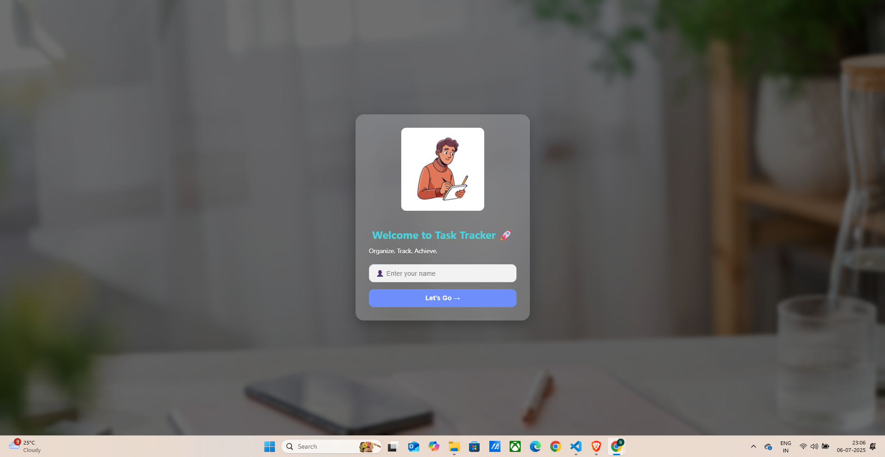
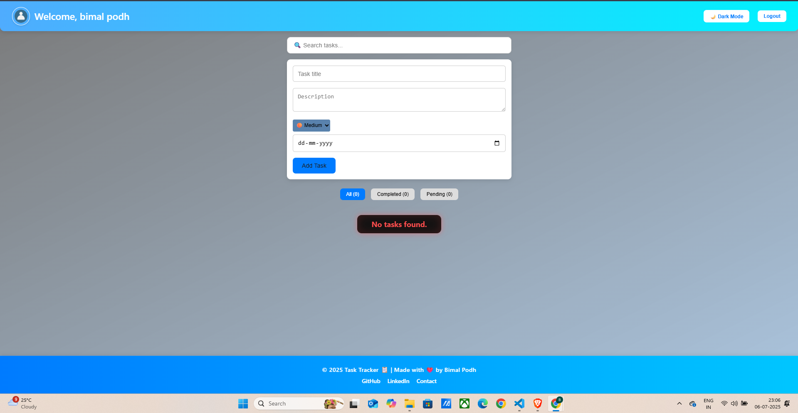
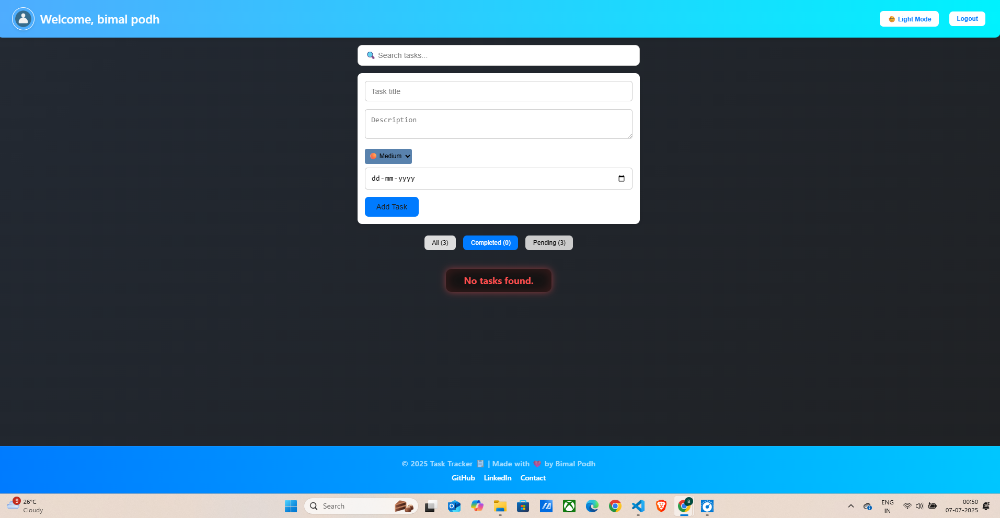
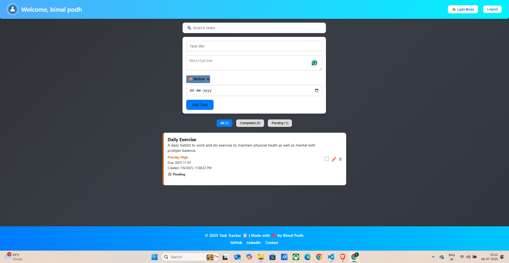

# Task Tracker 📋

A modern and fully-featured Task Tracking web application built with **React.js**. Designed for ease of use, beautiful responsive UI, and practical functionality including localStorage persistence, dark mode, priority filtering, and real-time search.

# 🚀 Live Demo
 - 🔗 Task-Tracker - "https://bimalpodh.github.io/task-tracker/"

---

## 🌐 Live Features Overview

### ✨ **Core Features Implemented:**

#### 1. **User Authentication (Local)**

* Simple login screen based on username.
* Once logged in, all task data is stored per user via `localStorage`.

#### 2. **Dashboard Page**

* Contains all major functionalities:

  * TaskForm (add/edit)
  * TaskList
  * TaskFilter
  * Dark mode toggle
  * Search bar
  * Logout button

#### 3. **Task Creation & Editing**

* Add new task with:

  * Title
  * Description
  * Priority (High, Medium, Low)
  * Due Date
  * Automatically stores Created Date (ISO format).
* Edit existing task inline.

#### 4. **Task Display (TaskList)**

* Tasks displayed with visual tags:

  * Priority color label.
  * Completion status (checkbox toggle).
* Actions:

  * Edit ✏️
  * Delete 🗑️

#### 5. **Task Completion**

* Toggle complete/incomplete via checkbox.
* Completed tasks appear dimmed with green style.

#### 6. **Search Functionality**

* Live filter by task title or description.
* Fully responsive with placeholder icon: “Search tasks…”

#### 7. **Priority-Based Sorting**

* Tasks sorted by:

  1. Priority (High > Medium > Low)
  2. Due Date

#### 8. **Task Filter**

* Filter tabs:

  * All
  * Completed
  * Pending

#### 9. **Dark Mode**

* Toggle with smooth transition.
* Includes animated background in dark mode:

  * Gradient shift every 10 seconds

#### 10. **Footer Component**

* Responsive footer always fixed at the bottom.
* Includes:

  * Year copyright
  * Creator credits
  * Links to GitHub, Portfolio, Email

---

## 🌟 Technology Stack

* **React.js** (Hooks, useState/useEffect/useContext)
* **Vite** for blazing-fast dev server
* **SCSS (Nested CSS)** with custom animations
* **Responsive Design** for mobile, tablet, and desktop
* **localStorage** for data persistence (per user)

---

## 📁 Project Structure

.png)

```bash
/src
  /components
    - Dashboard.jsx
    - DarkModeToggle.jsx
    - LoginPage.jsx
    - TaskForm.jsx
    - TaskList.jsx
    - TaskFilter.jsx
    - Footer.jsx
    - TaskItem.jsx
  /assets
    - profile.png
    - bgimage.jpg
    - bg2.jpg
  /utils
    - localStorage.js
  App.jsx
  main.jsx
```

---

## 📊 How the Data Works

* On login, the username is stored in React Context.
* Tasks are saved under the key `tasks_${username}` in localStorage.
* Every user has their own unique data space.

---

## 📷 UI Screenshots (Add Images Here)

### Login Page



### Dashboard - Light Mode



### Dashboard - Dark Mode



### Task Form



### Footer


---

## 🚀 Future Enhancements

* Firebase/Backend user auth
* Firebase DB integration
* Drag-and-drop task sorting
* Tag-based categorization
* Task reminder notifications

---

## 📄 License

This project is open source under the MIT License.

---

## 🎓 Author

**Bimal Podh**

* GitHub: [@Bimalpodh](https://github.com/Bimalpodh)
* LinkedIn: [@Bimalpodh.com](https://www.linkedin.com/in/bimal-podh-2a00542b0/)
* Email: [bimalpodh.com](mailto:bimalpodh08@gmail.com)

---

> "Stay productive. Stay organized. Track your success."

---
